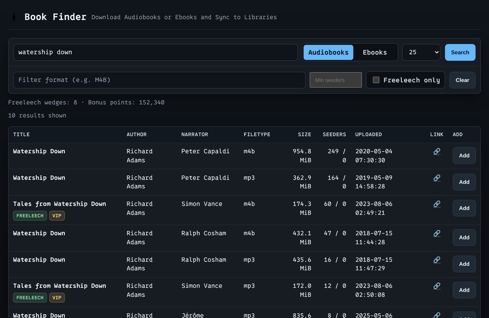
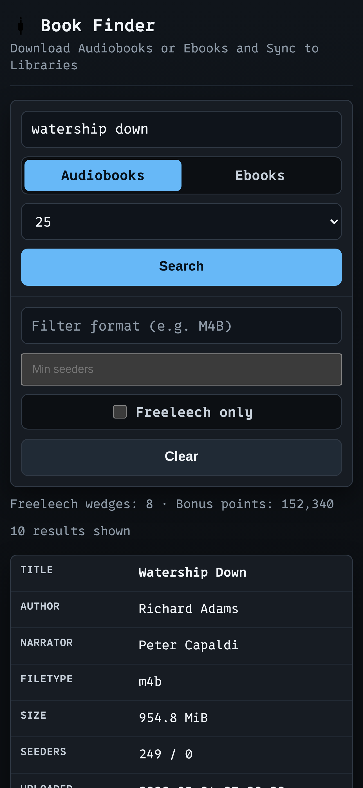

# MAM Book Finder

Lightweight web app and API for searching MyAnonamouse, sending downloads to Transmission, and importing completed books into audiobook and ebook libraries.

## Screenshots

| Desktop | Mobile |
| --- | --- |
|  |  |

## What It Does

- Search MAM for audiobooks and ebooks
- Add torrents to Transmission with a dedicated label
- Track download history
- Auto-import completed audiobooks into `/library` using hardlinks
- Auto-import completed ebooks into `/ebooks-nosend` (default) or `/ebooks` (when `Send to Kindle` is checked) using copies
- Import ebooks into `/ebooks-nosend` by default; check `Send to Kindle` before adding to import into `/ebooks` instead

## Requirements

- Docker and Docker Compose
- Transmission with RPC enabled
- A valid MAM session cookie
- Mounted host paths for `/data`, one shared audiobook media root, an ebook library, and an ebook no-send library

## Quick Start

1. Set your MAM and Transmission settings in `docker-compose.yml`.
2. Mount your host storage to the in-container paths:
   - `/data` for the SQLite database
   - `/storage` for a shared audiobook media root with `downloads` and `audiobooks` subdirectories
   - `/ebooks` for ebooks
   - `/ebooks-nosend` for ebooks that should not be sent to Kindle
3. Start the app:

   ```bash
   docker compose up -d --build
   ```

4. Open the UI at `http://localhost:8080`.

The app exposes `/downloads` and `/library` as symlinks into `/storage/downloads` and `/storage/audiobooks`. This keeps the app paths stable while allowing audiobook hardlinks to work.

If you use Transmission in Docker, mount the same host media root or downloads subdirectory there so completed paths still resolve under `/downloads`. Downloads and the audiobook library must live on the same filesystem; otherwise audiobook imports fail and the History table shows `Failure` with the hardlink error. Ebook imports continue to copy into `/ebooks` or `/ebooks-nosend`.

## Configuration

Runtime config comes from environment variables in `docker-compose.yml`.

| Variable | Purpose |
| --- | --- |
| `MAM_COOKIE` | MAM session cookie |
| `TRANSMISSION_URL` | Transmission RPC URL |
| `TRANSMISSION_USER` | Transmission RPC username |
| `TRANSMISSION_PASS` | Transmission RPC password |
| `TORRENT_CLIENT` | Download client: `transmission` (default) or `qbittorrent` |
| `QB_URL` | qBittorrent Web UI URL (used when `TORRENT_CLIENT=qbittorrent`) |
| `QB_USER` | qBittorrent Web UI username |
| `QB_PASS` | qBittorrent Web UI password |
| `QB_CATEGORY` | qBittorrent category applied to adds and used to find completed downloads (default `mam-audiofinder`) |
| `QB_TAGS` | Extra comma-separated qBittorrent tags applied to adds, in addition to the `mamid=` tag |
| `FL_WEDGE_MIN_RESERVE` | Keep this many freeleech wedges unspent (0 = spend freely) |
| `NOTIFY_WEBHOOK_URL` | Optional webhook for import-failure notifications (empty = disabled) |
| `PORT` | Port the app listens on inside the container (default `8080`); set this to avoid a clash when sharing another container's network namespace |

### Download client

`TORRENT_CLIENT` selects which download client the app talks to: `transmission` (default) or `qbittorrent`. When set to `qbittorrent`, set `QB_URL`, `QB_USER`, and `QB_PASS`, and optionally `QB_CATEGORY` (default `mam-audiofinder`) and `QB_TAGS`. qBittorrent's completed downloads must be visible at `/downloads` inside the app container — the same shared-mount requirement as Transmission — and downloads and the audiobook library must share one filesystem for hardlinks to work.

## Notes

- Search, add, and history are available from the main UI.
- The `Send to Kindle` ebook toggle defaults **off**: new ebook adds are tagged `kindle-nosend` in Transmission and imported into `/ebooks-nosend`. Check `Send to Kindle` before adding to send the ebook to Kindle and import it into `/ebooks` instead.
- Failed imports show `Failure` in history and can be retried with the row's `Retry` button after fixing the underlying path, mount, or permission issue.
- The app has no authentication, so do not expose it directly to the public internet.
- Freeleech wedges are spent automatically on audiobook adds. Set `FL_WEDGE_MIN_RESERVE` to keep a reserve — with `5`, the app stops using wedges once your balance reaches 5 and adds normally instead. The default `0` spends whenever any are available.
- Set `NOTIFY_WEBHOOK_URL` to receive a plain-text message whenever an import fails — for example an [ntfy](https://ntfy.sh) topic URL. Leave it empty to disable notifications. Delivery is best-effort: a webhook that is down is logged and ignored, never retried, and never affects the import itself.

## License

MIT
