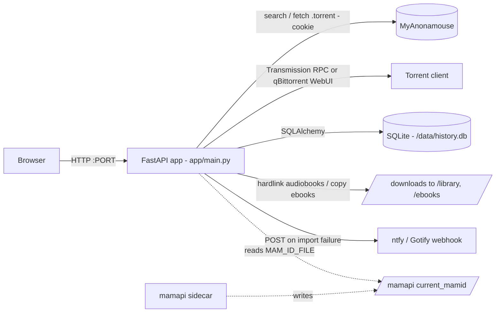
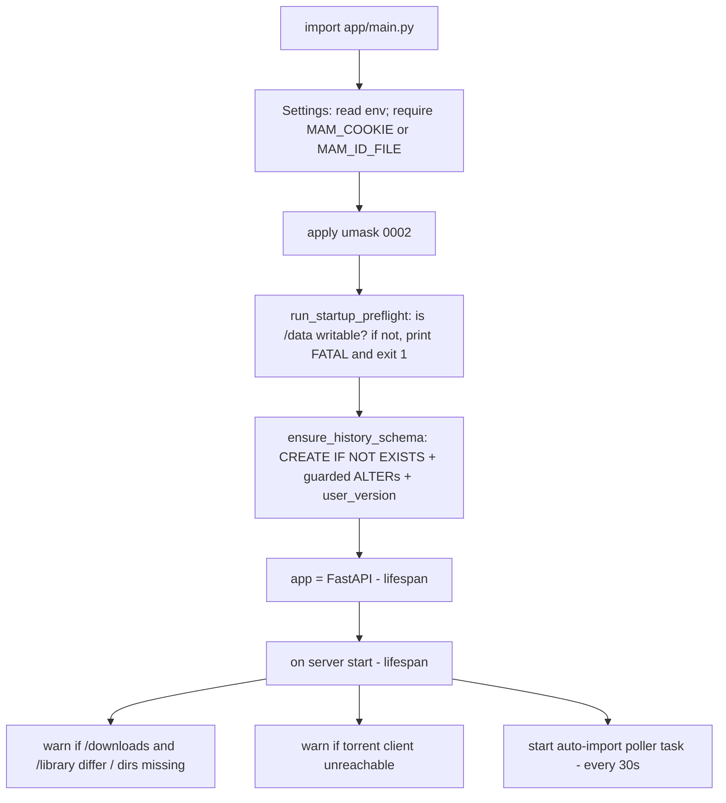

# Plan 031: Right-sized engineering handbook under `docs/`

> **Executor instructions**: Follow this plan step by step. Produce every file in
> the "Doc map" and satisfy the "Done criteria". This plan creates **documentation
> only** — you must not modify any application code, config, or tests. Every fact
> you write must be verifiable in the code at the cited location; when you cite a
> `file:line`, open it and confirm before writing. If a STOP condition occurs,
> stop and report. When done, update the status row for this plan in
> `plans/README.md` unless a reviewer told you they maintain the index.
>
> **Drift check (run first)**: `git diff --stat 4caefc1..HEAD -- app/ Dockerfile .github/`
> If the app changed since this plan was written, the inlined facts below may be
> stale — re-verify each against the live code before writing it into a doc.

## Status

- **Priority**: P3
- **Effort**: L (writing-heavy, but low-risk — docs only)
- **Risk**: LOW — no source/config/test changes; worst case is an inaccurate doc, caught in review
- **Depends on**: none
- **Category**: docs
- **Planned at**: commit `4caefc1`, 2026-08-03

## Why this matters

A new senior engineer should be able to understand, run, extend, and deploy this
app from `docs/` alone. Today the knowledge is spread across `README.md`,
`AGENTS.md`, two ADRs, and 31 plan files. This plan produces a **right-sized,
cross-linked handbook** — the ~10 documents that actually onboard someone for
**this** app, with Mermaid diagrams, reusing (linking, not duplicating) the ADRs
and the `plans/` audit record.

**Scope discipline (important — this is a small app):** the backend is a *single
file* (`app/main.py`), the frontend is *vanilla JS* (`app/static/app.js` + one
CSS + two Jinja templates) with **no build system, no bundler, no framework**,
there is **no CLI**, and persistence is **one SQLite table**. Do **not** invent a
`modules/` or `features/` tree, a `cli.md`, a `build-system.md`, or per-endpoint
files — that would produce stubs. Everything folds into the ~10 docs below.

## Current state (facts to reuse — verify each before writing)

- **Backend**: `app/main.py` (~1243 lines), FastAPI, one module. Run:
  `uvicorn main:app` (Dockerfile CMD is `sh -c "exec uvicorn main:app --host 0.0.0.0 --port ${PORT:-8080}"`).
- **Frontend**: `app/static/app.js` (~488), `app/static/common.css` (~366),
  `app/templates/base.html` + `index.html`. Served by FastAPI (`app.mount("/static", ...)`, `Jinja2Templates`).
- **Persistence**: SQLAlchemy Core over SQLite; one `history` table; DB at
  `HISTORY_DB_URL` (default `sqlite:////data/history.db`).
- **Deps** (`requirements.txt`): `fastapi`, `uvicorn[standard]`, `jinja2`,
  `httpx`, `sqlalchemy`. Dev (`requirements-dev.txt`): `pytest`, `respx`.
- **Tests**: `cd app && python -m pytest -q` (52 tests as of this commit). No JS tests.
- **Existing intent docs to LINK (not restate)**: `docs/adr/0001-authentication.md`
  (reverse-proxy auth, no in-app auth), `docs/adr/0002-configuration-philosophy.md`
  (tiered config model), `README.md`, `AGENTS.md`, and `plans/README.md` (the audit record).
- **CI/release**: `.github/workflows/docker-publish.yml` — push to `master` →
  test job (gate) → multi-arch (`linux/amd64,linux/arm64`) build+publish to
  `ghcr.io/d7eeem/mam-audiofinder-transmission-qbit` → auto version tag + GitHub release.
  `[skip ci]` in a commit message skips it. Dependabot config at `.github/dependabot.yml`.

### Reference data used by multiple docs (verify against `app/main.py`)

**HTTP endpoints** (`grep -n "@app\." app/main.py`):
| Method | Path | Purpose |
|---|---|---|
| GET | `/` | HTML UI (Jinja `index.html`) |
| POST | `/search` | Search MAM; returns `{results:[…], freeleech_wedges}` |
| POST | `/add` | Add a torrent to the client + record history |
| GET | `/account` | MAM account summary (freeleech wedge count) |
| GET | `/history` | Recent history rows |
| POST | `/history/{history_id}/retry` | Re-run a failed import |

**Environment variables** (all `os.getenv` in `app/main.py`, plus `PORT` read by
the Dockerfile entrypoint) — the executor must confirm each and describe it:
`MAM_COOKIE`, `MAM_ID_FILE`, `TORRENT_CLIENT` (`transmission`|`qbittorrent`),
`TRANSMISSION_URL/USER/PASS`, `QB_URL/USER/PASS/CATEGORY/TAGS`,
`FL_WEDGE_MIN_RESERVE`, `NOTIFY_WEBHOOK_URL`, `HISTORY_DB_URL`, `APP_VERSION`, `PORT`.

**Hardcoded constants** (top of `app/main.py`): `DOWNLOADS_DIR="/downloads"`,
`LIBRARY_DIR="/library"`, `EBOOKS_DIR="/ebooks"`, `EBOOKS_NOSEND_DIR="/ebooks-nosend"`,
`DEFAULT_UMASK="0002"`, `DEFAULT_AUTO_IMPORT_POLL_INTERVAL=30`,
`DEFAULT_QB_CATEGORY="mam-audiofinder"`, `DEFAULT_MAM_BASE`, `DEFAULT_NOTIFY_TIMEOUT=10`.

**`history` table columns** (from `ensure_history_schema()`): `id, mam_id, title,
author, narrator, media_type, dl, added_at, imported_at, torrent_status,
torrent_hash, status_detail, status_updated_at, send_to_kindle`; schema version
tracked via `PRAGMA user_version`.

**Torrent-client abstraction**: base `class TorrentClient` with `add_torrent`,
`completed_hashes`, `torrent_source`, `reachable`; `TransmissionClient` (JSON-RPC
via `transmission_rpc`) and `QbittorrentClient` (WebUI API v2, `_login` +
category/tags); `get_torrent_client()` factory keyed on `TORRENT_CLIENT`.

## Conventions every doc must follow

- Markdown, in `docs/`. Start each doc with a one-line **Overview / Purpose**,
  then detail, then a **Related documents** list of cross-links (relative links).
- **Facts from code, not assumptions.** Cite `app/main.py:NNN` (or the relevant
  file) for non-obvious claims. If something is genuinely uncertain, say so and
  say why — never invent behavior.
- **Link, don't duplicate**: for auth → link `docs/adr/0001-authentication.md`;
  for config philosophy → link `0002`; for the finding backlog → link `plans/`.
- Mermaid diagrams go in ```` ```mermaid ```` fences.
- No stub files, no "TODO: fill in", no "N/A" placeholder docs.

## Doc map (create exactly these)

1. **`docs/README.md`** — index. One-paragraph "what is this app", then a linked
   table of contents to every doc below (+ the two ADRs). This is the entry point.
2. **`docs/architecture.md`** — the whole system. Sections: components (FastAPI
   single-file backend, vanilla-JS frontend, SQLite, torrent-client abstraction,
   MAM integration, optional mamapi handoff, optional notify webhook), tech stack
   (the 5 deps + why), request lifecycle, and the **startup sequence**. Include the
   **High-level** and **Startup** Mermaid diagrams (provided below). Fold in what
   the spec called codebase-overview / project-structure / tech-stack / backend /
   frontend — this app is small enough that they belong here.
3. **`docs/configuration.md`** — every env var (table from Reference data) with
   default, whether it's a secret, and effect; the hardcoded path/umask/poll
   constants and why they're not env-configurable; link ADR-0002 for the tiered
   model. Note `MAM_COOKIE` **or** `MAM_ID_FILE` is required (one must be set).
4. **`docs/api.md`** — the 6 endpoints: method, path, request body/params,
   response shape, error codes (they raise `HTTPException` with `status_code`),
   and a short `curl`/JSON example each. Auth: none in-app (link ADR-0001).
5. **`docs/data-model.md`** — the `history` table (column list + meaning +
   `torrent_status` lifecycle: `added → importing → imported | import_failed`),
   the SQLite location, and the **migration approach** (`ensure_history_schema()`:
   `CREATE TABLE IF NOT EXISTS` + guarded `ALTER`s + `PRAGMA user_version`; runs at
   import). Link plan `023` for the upgrade-safety design.
6. **`docs/import-pipeline.md`** — the core feature, end to end: search → add
   (category/`mamid=` tag) → auto-import poller (every 30s) → `torrent_source` →
   **hardlink** `/downloads`→`/library` for audiobooks, **copy** for ebooks →
   history status. Cover the torrent-client abstraction, the freeleech-wedge
   spend + `FL_WEDGE_MIN_RESERVE`, and "Send to Kindle" routing (`/ebooks` vs
   `/ebooks-nosend`). Include the **Add + import** sequence diagram (below).
7. **`docs/deployment.md`** — Docker image (multi-arch, GHCR path), the
   `docker-compose` shape, the **cross-container contracts** (qBittorrent must
   save under `/downloads`; `/downloads` and `/library` must share one filesystem
   for hardlinks; container runs as root and ignores PUID/PGID — use `user:`),
   `PORT` for shared-namespace/VPN setups, reverse-proxy auth (link ADR-0001), and
   a **Troubleshooting** section (unwritable `/data` → the `[preflight] FATAL`
   message; `Failure` in history → cross-device hardlink or save-path mismatch).
8. **`docs/development.md`** — install (venv + `pip install -r requirements.txt -r
   requirements-dev.txt`), run (`cd app && uvicorn main:app --reload`), test
   (`cd app && python -m pytest -q`), the release process (push `master` → CI →
   tag; `[skip ci]` for docs), and how the `plans/` + `/improve` advisor loop is
   used to make changes. Note: no linter/formatter/JS-build is configured.
9. **`docs/security.md`** — posture, grounded in the code and ADRs: no in-app auth
   by design (link ADR-0001 — deploy behind a reverse proxy, do not expose
   publicly); SQL uses SQLAlchemy bound params; frontend escapes text via
   `escapeHtml`; path-traversal hardening on imports (`safe_child_path`,
   `validate_download_path`); secrets are env/file only and never logged; the MAM
   cookie / `MAM_ID_FILE` handling. Link the relevant plans (003, 011) and note
   the known latent items from `plans/README.md` (e.g. `escapeHtml` quote gap —
   currently unreachable).
10. **`docs/audit.md`** — a **distilled** audit that points to the real record
    rather than restating it: a dependency table (5 runtime deps, pinned, all
    actively maintained), the tech-debt / roadmap backlog (the deferred **D5**
    library-scan trigger and **D6** Send-to-Kindle delivery from `plans/README.md`),
    a one-line performance note (single-user app; sync SQLite on the event loop is
    a documented accepted tradeoff — link the "considered and rejected" section),
    and a "dead code / findings" summary that **links `plans/README.md`** as the
    authoritative audit history. Make clear this file is an index into `plans/`, not
    a duplicate.

**Mapping note for the doc** (put a short line in `docs/README.md`): the app is
small enough that `tech-stack`, `codebase-overview`, `project-structure`,
`backend`, `frontend`, `build-system`, `testing`, `performance`, `integrations`,
`troubleshooting`, `roadmap`, and `changelog-audit` are folded into the docs above
rather than given their own (would-be-stub) files; there is no `cli.md` (no CLI).

## Mermaid diagrams to include (use these; verify the labels against the code)

**High-level architecture** → `docs/architecture.md`:


**Startup sequence** → `docs/architecture.md`:


**Add + auto-import** → `docs/import-pipeline.md`:
```mermaid
sequenceDiagram
  participant B as Browser
  participant A as App
  participant M as MAM
  participant T as Torrent client
  participant D as SQLite
  B->>A: POST /add {id,title,dl,media_type,...}
  A->>M: download .torrent (cookie)
  A->>T: add_torrent (category, tag mamid=<id>)
  A->>D: insert history (torrent_status=added)
  A-->>B: {freeleech_wedges}
  loop every 30s (auto-import poller)
    A->>T: completed_hashes()
    A->>T: torrent_source(hash) -> files, save_path
    A->>A: validate under /downloads; hardlink->/library (audiobook) or copy->/ebooks
    A->>D: update torrent_status = imported | import_failed
  end
```

## Commands you will need

| Purpose | Command | Expected |
|---|---|---|
| Confirm endpoints | `grep -n "@app\.\(get\|post\)" app/main.py` | the 6 routes above |
| Confirm env vars | `grep -nE "os\.getenv" app/main.py` | the variables listed above |
| Mermaid fences present | `grep -rc '```mermaid' docs/` | ≥ 3 across the docs |
| No stub markers | `grep -rniE "TODO: fill|N/A placeholder|lorem ipsum" docs/` | no matches |
| App still untouched | `git diff --stat 4caefc1..HEAD -- app/ Dockerfile .github/ requirements*.txt` | empty |

## Scope

**In scope**: create the 10 files under `docs/` listed in the Doc map. You may
read any file in the repo to source facts.

**Out of scope** (do NOT modify): `app/` (all code), `Dockerfile`,
`.github/`, `requirements*.txt`, `README.md`, `AGENTS.md`, the existing
`docs/adr/*` files (link them, don't edit), and everything under `plans/` except
this plan's status row. Do not create `docs/cli.md`, `docs/build-system.md`,
`docs/modules/`, `docs/features/`, or `docs/api/` per-endpoint files. Do not add a
docs build tool, linter, or site generator.

## Git workflow

- Branch: `advisor/031-engineering-handbook-docs`
- Commit the `docs/` additions. Short imperative subject
  (e.g. `Add engineering handbook under docs/`). Do NOT push or open a PR.

## Test plan

Docs have no unit tests. Verification is structural + accuracy-by-review:
1. All 10 files exist and are non-empty; `docs/README.md` links to each.
2. Every relative cross-link resolves to a real file (no dead links).
3. Each fact with a `file:line` citation matches the live code (spot-check).
4. Mermaid blocks are syntactically valid fenced code (```` ```mermaid ````).
5. `git diff --stat 4caefc1..HEAD -- app/ Dockerfile .github/ requirements*.txt` → empty (no code touched).
Reviewer will read the docs for accuracy and check the diagrams render.

## Done criteria

Machine-checkable. ALL must hold:

- [ ] These exist and are non-empty: `docs/README.md`, `architecture.md`,
      `configuration.md`, `api.md`, `data-model.md`, `import-pipeline.md`,
      `deployment.md`, `development.md`, `security.md`, `audit.md`
- [ ] `grep -rc '```mermaid' docs/ | awk -F: '{s+=$2} END{print s}'` → ≥ 3
- [ ] `grep -Rl 'docs/adr/0001-authentication' docs/` and `…0002-configuration` each match ≥ 1 doc (ADRs are linked)
- [ ] `grep -Rl 'plans/README' docs/audit.md` matches (audit links the plan record)
- [ ] `grep -rniE "TODO: fill|placeholder|lorem ipsum" docs/` → no matches
- [ ] No `docs/cli.md`, `docs/build-system.md`, `docs/modules/`, `docs/features/`, `docs/api/` created
- [ ] `git diff --stat 4caefc1..HEAD -- app/ Dockerfile .github/ requirements*.txt README.md AGENTS.md docs/adr/` → empty
- [ ] `git status --porcelain` shows only new files under `docs/`
- [ ] `plans/README.md` row for 031 updated

## STOP conditions

Stop and report back (do not improvise) if:

- The drift check shows `app/main.py`/`Dockerfile`/workflow changed materially
  from the inlined facts — the reference data may be stale; report rather than
  documenting something you can't verify.
- You cannot verify a claim in the code (e.g. an endpoint or env var the plan
  lists isn't there) — document only what you can confirm and flag the discrepancy.
- Producing an accurate doc seems to require inventing behavior or a subsystem
  that doesn't exist (e.g. a CLI, a queue, a cache) — it doesn't; omit it.

## Maintenance notes

- These docs describe `4caefc1`. When the app changes, the most drift-prone docs
  are `configuration.md` (env vars), `api.md` (endpoints), and `data-model.md`
  (schema) — update them alongside code changes.
- `docs/audit.md` intentionally indexes `plans/` rather than copying it; keep it a
  pointer so the two don't diverge.
- Reviewer: spot-check each `file:line` citation, confirm the three Mermaid
  diagrams render, verify no stub files and no source changes, and confirm the
  ADRs are linked rather than duplicated.
